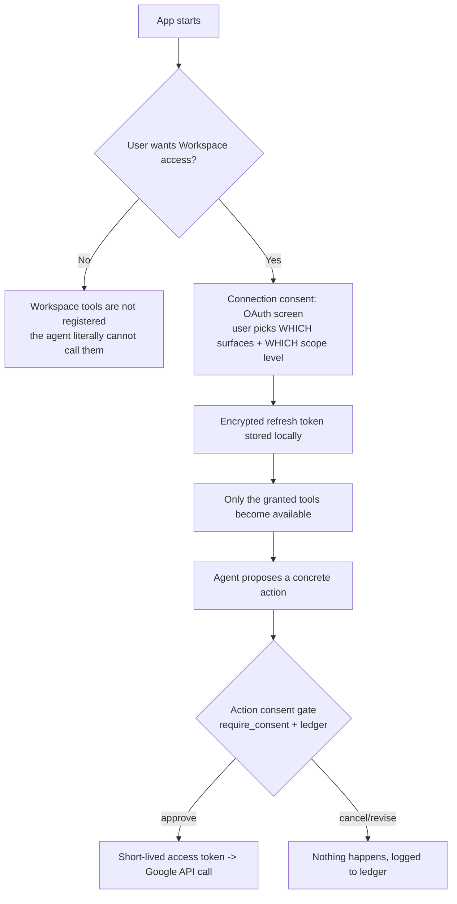

# Google Workspace Integration — Design & Implementation Plan

> Goal: let MoneyPenny access **Google Drive, Gmail, and Calendar** *under user consent*,
> so it can be more productive — while preserving the default-deny guarantee from
> [`../consent-architecture/`](../consent-architecture/README.md).
>
> Core requirement: **the user decides, at connect time, how much access to grant** —
> nothing is assumed, and the grant is revocable.

---

## 1. The central idea: two independent layers of consent

Workspace access introduces a *connection* grant that must not be confused with an
*action* grant. Keeping them separate is what makes this safe.



| Layer | Question | Mechanism | Frequency |
|---|---|---|---|
| **1. Connection consent** | "May MoneyPenny touch my Drive/Gmail/Calendar at all, and how much?" | Google OAuth (incremental, user-chosen scopes) | Once per surface, revocable |
| **2. Action consent** | "May MoneyPenny do THIS specific thing right now?" | Existing `gate()` + `require_consent()` | Every consequential action |

**Connecting is not consenting to act.** Even with Gmail connected, *sending* still hits the
per-action gate. This is the "capable, but never presumptuous" principle applied to a new
surface.

---

## 2. User-chosen permissions (the connect flow)

Per the requirement, the grant flow **prompts the user and lets them decide** — both *which
surfaces* and *how much* on each. Nothing is hard-coded to "full access."

### Surface + level menu (shown at connect time)

| Surface | Level options (user picks one) | Google OAuth scope |
|---|---|---|
| **Drive** | Off / App-files only / Read existing / Full | none / `drive.file` / `drive.readonly` / `drive` |
| **Gmail** | Off / Read / Send / Read+Send / Modify | none / `gmail.readonly` / `gmail.send` / both / `gmail.modify` |
| **Calendar** | Off / Read free-busy / Read events / Read+Write | none / `calendar.freebusy` / `calendar.readonly` / `calendar.events` |

Design rules for the menu:

- **Default highlighted = least privilege** (`drive.file`, Gmail `read`, Calendar `freebusy`),
  with a one-line plain-English explanation of what each unlocks and what it *cannot* do.
- **Incremental authorization.** Start minimal; if the agent later needs more, it can request
  an *upgrade* grant on demand ("To search your existing Drive files I need read access —
  allow?") rather than over-asking up front.
- **Per-surface, independent.** Granting Drive does not grant Gmail. Each is its own consent.
- **Always revocable.** A "Disconnect / downgrade" control is part of the same UI.

### The grant is itself a ledger event

The OAuth grant (and any later upgrade/downgrade/revoke) is recorded in the consent ledger
as a first-class entry — so "what access did I give, and when?" is auditable, just like
actions.

---

## 3. How it maps onto the existing codebase

The integration follows the exact shape of `agent1`–`agent5`. No new patterns are invented.

| Concern | New module | Mirrors existing |
|---|---|---|
| Workspace specialist agent | `ai/agents/agent6.py` (`get_workspace_agent()`) | `ai/agents/agent5.py` |
| Orchestrator delegation tool | `delegate_workspace(...)` in `ai/agents/orchestrator.py` | `delegate_knowledge_base` |
| Drive tool wrappers | `tools/google_drive.py` | `tools/knowledge_base.py` |
| Gmail tool wrappers | `tools/gmail.py` | `tools/sending_email.py` |
| Google Calendar wrappers | `tools/google_calendar.py` | `tools/calendar.py` |
| OAuth + token storage | `tools/google_auth.py` | (new — see §5) |
| Pydantic schemas | `schemas/agent6.py` | `schemas/agent5.py` |
| Prompt | `ai/prompts/workspace_agent.md` | `ai/prompts/knowledge_base_agent.md` |

Every side-effecting wrapper calls `require_consent(action_type)` at the top — identical to
the hardening already shipped for email/calendar/comms/knowledge.

```python
# tools/google_drive.py  (sketch — same guardrail as every other tool)
from tools.execution_lock import require_consent

def share_file(file_id: str, email: str, creds) -> str:
    require_consent("drive.share")          # fails closed without a gate-issued grant
    service = build("drive", "v3", credentials=creds)
    service.permissions().create(fileId=file_id, body={...}).execute()
    return "shared"
```

### New `ActionType` entries (`schemas/consent.py`)

```python
ActionType = Literal[
    # ... existing ...
    # Drive
    "drive.read", "drive.list", "drive.upload", "drive.update",
    "drive.share", "drive.delete",
    # Gmail
    "gmail.read", "gmail.search", "gmail.send", "gmail.modify", "gmail.delete",
    # Google Calendar
    "gcal.read", "gcal.freebusy", "gcal.create", "gcal.update", "gcal.delete",
    # Connection lifecycle (auditable in the ledger)
    "workspace.connect", "workspace.upgrade_scope", "workspace.revoke",
]
```

### Credentials on `OrchestratorDeps`

A new optional field carries a credentials provider, so tools can fetch a fresh access
token. When it's `None`, the workspace tools aren't registered at all.

```python
# ai/agents/deps.py
workspace_creds: WorkspaceCredentialProvider | None = field(default=None)
"""Set only after the user completes the OAuth connect flow. None => no workspace tools."""
```

---

## 4. Trust-tier mapping (where this pays off)

This is the productivity win without weakening default-deny — it leans directly on
[`../consent-architecture/04-trust-tiers.md`](../consent-architecture/04-trust-tiers.md).

| Action | Reversible? | Observer? | Tier | Behavior |
|---|---|---|---|---|
| `drive.read`, `drive.list`, `gmail.read`, `gmail.search`, `gcal.read`, `gcal.freebusy` | read-only | none | **0 — silent** | Agent browses/summarizes freely; no interruption |
| `drive.upload`, `drive.update` (app-owned file) | yes (delete to revert) | none | **0–1** | Silent or soft-confirm |
| `gcal.create` / `gcal.update` (no attendees) | yes | none | **0–1** | Soft-confirm |
| `gmail.send`, `drive.share`, `gcal.create` (with attendees) | no | third party | **2 — hard stop** | Always gated; data egress / external commitment |
| `drive.delete`, `gmail.delete` | hard to revert | — | **2 — hard stop** | Always gated |

Net effect: MoneyPenny can **read** your Workspace to be useful, but **sending, sharing,
inviting, and deleting** still stop for your word.

---

## 5. OAuth & credential handling

- **Flow:** Installed-app / loopback OAuth 2.0 (`google-auth-oauthlib`, already a dependency).
  For the hosted web demo, swap to a web redirect flow behind the same `google_auth.py`
  interface.
- **What's stored:** the long-lived **refresh token**, **encrypted at rest** (reuse the
  `CONSENT_SECRET` pattern from `config.py`, or a dedicated `WORKSPACE_TOKEN_KEY`). Access
  tokens are short-lived and fetched on demand — never persisted.
- **Where:** a gitignored path (extend the existing `.consent/`-style ignore, e.g.
  `.workspace/credentials.enc`). **Never commit tokens.**
- **Refresh:** transparent in `google_auth.py`; tools always receive a valid access token.
- **Config:** `GOOGLE_CLIENT_ID`, `GOOGLE_CLIENT_SECRET`, `GOOGLE_REDIRECT_URI` added to
  `config.py` (env-driven, like the existing keys).

---

## 6. Overlaps with what already exists

| Surface | Today | With Workspace | Resolution |
|---|---|---|---|
| **Calendar** | **Google Calendar API** (`tools/calendar.py`, `agent2`) — *macOS/AppleScript calendar has been removed* | Same backend, now using the user's real OAuth creds | ✅ **Decided: Google Calendar only.** The tools already target Google and fall back to demo mode until the OAuth grant is wired up. No provider abstraction needed. |
| **Email** | Send-only via Resend (`tools/sending_email.py`, `agent1`) | Gmail can **read** + send as the user's address | Keep Resend for app-originated notifications; add Gmail for reading the inbox and sending *as the user*. Distinct action types (`email.send` vs `gmail.send`). |

Gmail unlocks a genuinely new capability the app doesn't have today: **reading/triaging your
inbox** ("what did Priya say about the deck?"), not just sending.

---

## 7. Security checklist

- **Least privilege by default** — menu defaults to the narrowest scope; broader scopes are
  opt-in and explained.
- **Incremental auth** — request more only when a task needs it.
- **Revocation = kill switch** — "Disconnect" deletes the encrypted token *and* calls
  Google's token-revoke endpoint; ties into the Phase 3 kill-switch concept in
  [`../consent-architecture/03-observability-and-ledger.md`](../consent-architecture/03-observability-and-ledger.md).
- **Tokens encrypted at rest**, gitignored, never logged.
- **Action gate still applies** — connection never bypasses per-action consent.
- **Scope-action consistency** — a tool's `require_consent("gmail.send")` should be
  unreachable if only `gmail.readonly` was granted (validate granted scopes before
  registering write tools).
- **Demo mode** — like the macOS tools, provide a simulated backend so the flow runs in CI /
  without real Google credentials.

---

## 8. Phased implementation plan

### Phase A — Auth foundation
1. `config.py`: add `google_client_id/secret/redirect_uri`, `workspace_token_key`.
2. `tools/google_auth.py`: OAuth connect flow, encrypted token store, refresh, **scope menu**
   (user picks surfaces + levels), revoke. Returns a `WorkspaceCredentialProvider`.
3. `.gitignore`: ignore `.workspace/`.
4. Ledger: record `workspace.connect` / `upgrade_scope` / `revoke`.

### Phase B — Read-only productivity (safe, high value)
5. `schemas/agent6.py` + `tools/google_drive.py`/`gmail.py`/`google_calendar.py` — **read
   tools first** (`drive.list/read`, `gmail.search/read`, `gcal.read/freebusy`).
6. `ai/agents/agent6.py` + `delegate_workspace` in the orchestrator.
7. Add read action types; map them to **Tier 0** (silent) once trust tiers land, or just
   no-gate reads in the interim (they have no side effects).

### Phase C — Gated writes
8. Add write wrappers (`drive.upload/update/share/delete`, `gmail.send/modify`,
   `gcal.create/update/delete`), each calling `require_consent(...)`.
9. Register write tools **only if** the corresponding scope was granted.

### Phase D — Lifecycle & startup
10. Wire the connect prompt into `run_text.py` (and later `server.py`): on start, if no creds
    and the user opts in, run the scope menu; otherwise run without workspace tools.
11. "Disconnect / change access" command → revoke + re-prompt.

### Phase E — Tests (mirror `tests/consent/`)
12. `tests/workspace/`:
    - Tools fail closed without consent (`require_consent` raises) — like
      `test_tool_wrapper_lock.py`.
    - Write tool unavailable when only read scope granted.
    - Token store round-trips encrypted; revoke clears it.
    - Connect/upgrade/revoke produce ledger entries.
    - Read actions need no gate; writes do.

---

## 9. Open decisions

- ~~**Calendar backend:** Google Calendar *replacing* or *alongside* the macOS calendar agent?~~ **Decided: Google Calendar only; macOS calendar removed.**
- **Gmail "send as user"** vs keeping all outbound on Resend — which is the primary path?
- **Hosted demo:** loopback OAuth (desktop) vs web redirect (browser) — affects
  `google_auth.py` flow selection.
- **Scope-menu surface:** CLI prompt now, real consent screen in the frontend later?

---

*This plan keeps the guarantee intact: workspace access is opt-in, user-scoped, revocable,
and every consequential action still passes through the consent gate.*
